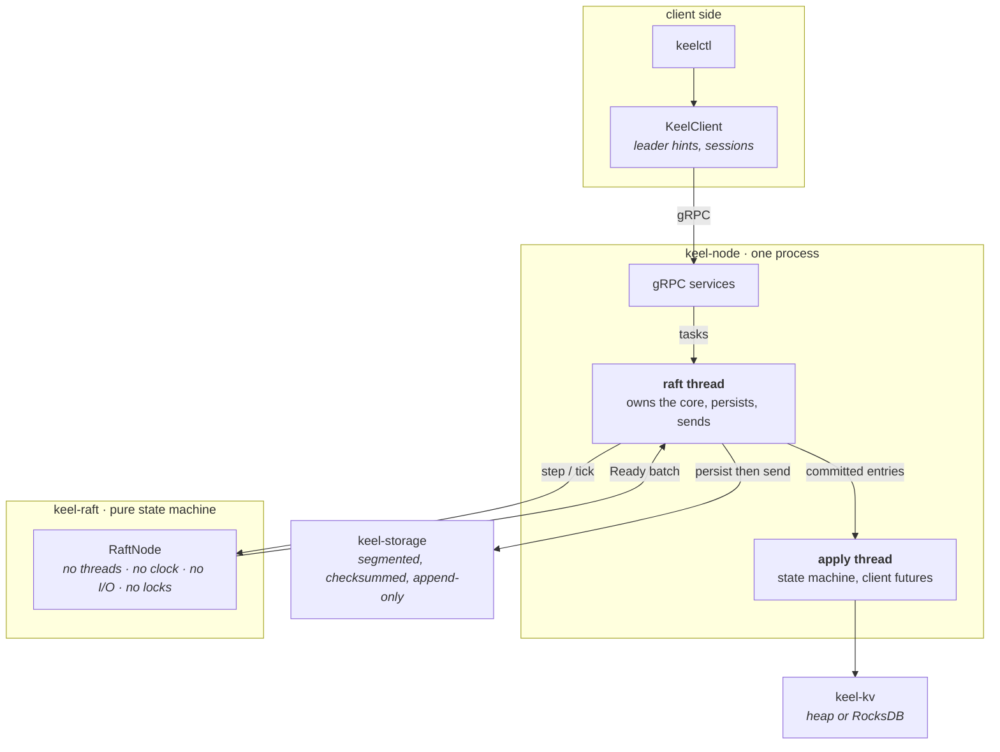
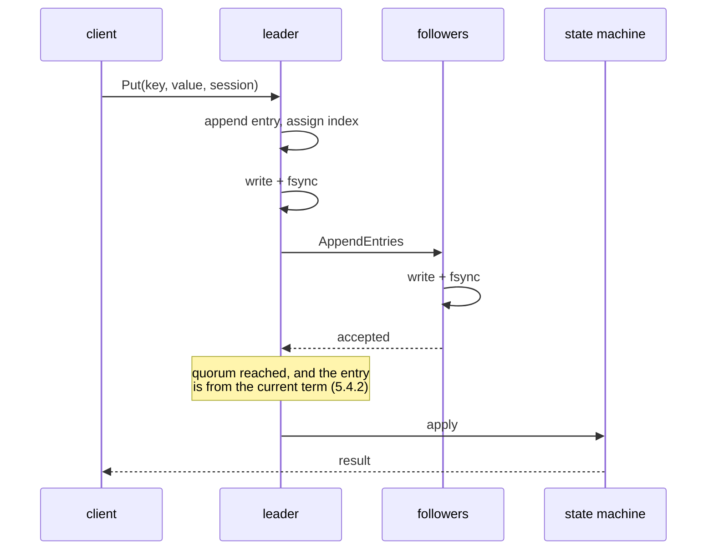

<h1 align="center">keel</h1>

<p align="center">
  A linearizable distributed key-value store in Java.<br>
  Raft written from scratch, a deterministic fault-injection simulator, and a linearizability checker.
</p>

<p align="center">
  <a href="https://github.com/jason-te-sde/keel/actions/workflows/ci.yml">
    
  </a>
  
  
  
  
  <a href="LICENSE"></a>
</p>

---

Most Raft projects prove they work by starting a cluster and watching it not fall over. This one
asserts every safety property in the paper after **every step** of a seeded simulation, and then
checks that what clients actually observed could have happened in some sequential order at all.

Three things make it worth a read:

- **The consensus core is a pure state machine.** No threads, no clock, no I/O, no locks. A whole
  cluster's behaviour — message latency, partitions, crashes, election timeouts — is a function of one
  integer seed, so a bug found at seed 8123 is still there at seed 8123 tomorrow.
- **The test suite found bugs that hand-written tests structurally could not.** Six of them, listed
  below with what caught each one.
- **It runs, and it is meant to be run by someone else.** Mutual TLS, token-authenticated clients,
  Prometheus metrics, a container image CI actually builds and exercises, and an operations guide
  written for three in the morning.

## Try it

```bash
docker compose up -d --wait                    # three nodes, health-checked
docker compose run --rm keelctl status
```

or without containers:

```bash
mvn package -DskipTests
./scripts/local-cluster.sh          # three nodes on 9001-9003
```

```console
$ keelctl --cluster=$CLUSTER status
node 1  FOLLOWER  term=1  leader=2  commit=1  applied=1  keys=0
node 2  LEADER    term=1  leader=2  commit=1  applied=1  keys=0
node 3  FOLLOWER  term=1  leader=2  commit=1  applied=1  keys=0

$ keelctl --cluster=$CLUSTER put greeting hello
ok

$ kill -9 <pid of node 2>

$ keelctl --cluster=$CLUSTER status
node 1  LEADER    term=2  leader=1  commit=6  applied=6  keys=1
node 2  unreachable (Connection refused)
node 3  FOLLOWER  term=2  leader=1  commit=6  applied=6  keys=1

$ keelctl --cluster=$CLUSTER get greeting
hello                                    # committed data survived the failover

$ keelctl --cluster=$CLUSTER member add 4=127.0.0.1:9004
voters: [1, 2, 3, 4]                     # a fourth node joins a running cluster
```

Requires JDK 21+ and Maven 3.9+, or just Docker. `protoc` and the gRPC generator are fetched by the
build.

**Before putting it anywhere real:** a node refuses to listen on a non-loopback address without TLS
and a client token, unless `--insecure` is passed. [`docs/operations.md`](docs/operations.md) covers
the flags, what to monitor, disk sizing, backup and restore, and upgrades.

## Use it as a library

The consensus core has no I/O, no threads, and no dependencies beyond the schema module, so it can
be driven by something other than this server. That is the module most people would want.

```xml
<dependency>
  <groupId>io.github.jason-te-sde</groupId>
  <artifactId>keel-raft</artifactId>
  <version>0.3.1</version>
</dependency>
```

| Module | What it is for |
| --- | --- |
| `keel-raft` | the consensus core, driven by you |
| `keel-storage` | a crash-recoverable write-ahead log implementing the core's storage port |
| `keel-kv` | the key-value state machine and client sessions |
| `keel-testkit` | the simulator and linearizability checker, usable against your own state machine |
| `keel-node` | the whole server, if you want it rather than the pieces |

**Not on Maven Central yet.** Publishing needs a Sonatype account and a signing key that cannot
live in the repository; [`RELEASING.md`](RELEASING.md) has the sequence. Until then, `mvn install`
puts the modules in your local repository, and each release has the runnable jar attached.

API documentation: **[jason-te-sde.github.io/keel](https://jason-te-sde.github.io/keel/)**

## Architecture



The load-bearing rule is one sentence: **one thread owns the core**. Everything arriving from a socket
or a client becomes a task on that thread, which is why the core needs no synchronization. Applying
runs separately so a slow state machine cannot stall replication.

`Ready` is the seam. The core returns a batch — hard state, entries, messages, committed entries — and
the driver must **sync before it sends**, because an acknowledgement is a promise of durability and a
leader counts acknowledgements toward a quorum. Making that one contract in one place is why the core
is handed a read-only view of storage and cannot reach a disk even by accident.

<details>
<summary><b>The path of a write</b></summary>



A retry of a timed-out write is deduplicated by the session table, so it applies exactly once. A write
whose index gets taken by another command failed to commit and is reported as such, so retrying is
safe.
</details>

<details>
<summary><b>The path of a linearizable read</b></summary>

Reading a leader's local state is <i>not</i> linearizable: a partitioned leader still believes it leads
for up to one election timeout. ReadIndex (paper 6.4) needs both of these, and dropping either is the
usual bug:

1. The leader must have committed an entry in its <b>current term</b>, so it knows its own committed
   prefix. That is what the no-op appended on election is for. Reads arriving earlier are held.
2. The leader must confirm it is <b>still</b> the leader with a heartbeat round to a quorum, taken
   <i>after</i> recording the index. Recording the commit index proves nothing on its own.

Heartbeats carry a round token so a response cannot be counted toward a round it does not belong to.
Followers forward the request, get an index back, wait for their own state machine to reach it, and
serve the read themselves — so reads scale with the cluster and stay linearizable. Nothing is appended
to the log.
</details>

## What is implemented

| | Paper | Notes |
| --- | :---: | --- |
| Leader election, randomized timeouts | 5.2 | |
| Log replication, conflict-index backtracking | 5.3 | Converges in a round trip per term, not per index |
| Election restriction | 5.4.1 | |
| Commit rule for earlier-term entries | 5.4.2 | The figure 8 case, with a test that holds it still |
| Log compaction and snapshots | 7 | Streamed; the response means *installed*, not received |
| Single-node membership changes | 4.3 | One at a time, so majorities always overlap |
| Pre-vote | 9.6 | Plus a test that shows the term running away without it |
| Check-quorum | 6.2 | |
| Linearizable reads via ReadIndex | 6.4 | On leaders **and** followers |
| Exactly-once client sessions | 6.3 | Part of the state machine, so snapshots carry them |
| Crash-recoverable write-ahead log | — | Checksummed, append-only, torn tails survivable |

And the parts that are about being run rather than about consensus:

| | Notes |
| --- | --- |
| Mutual TLS between nodes | the cluster CA is the membership boundary: a foreign certificate fails the handshake |
| Token-authenticated clients | with a **separate** admin token, because ejecting a node is not the same privilege as writing a value |
| Secure by default | a node refuses to bind a non-loopback address without TLS and a token, unless `--insecure` |
| Prometheus metrics | plus `/healthz` and `/readyz`, which answer different questions |
| Container image | built and exercised by CI, not just committed |
| Config file | properties, with flags overriding |
| Streamed snapshots | one chunk in memory on each side, so a state machine may exceed the heap |

Not implemented, on purpose: joint consensus, leader leases, leader transfer, learners,
certificate rotation without restart, rate limiting, multi-raft.
[`docs/design/0004-scope.md`](docs/design/0004-scope.md) gives the reasoning for each, and
[`SECURITY.md`](SECURITY.md) states what the project does and does not defend against.

## Numbers

Measured on an Apple M-series laptop, APFS, JDK 21. Every figure has the command that produced it.

| | |
| --- | --- |
| Tests | **253** (plus one benchmark, off by default) |
| Line / branch coverage | **84.9% / 78.5%** |
| Simulation throughput | **149,149 ticks/s** |
| Soak run | 10,000 seeds, **12,000,000 invariant checks**, 572,141 snapshots, **81s**, zero violations |
| Log append, no fsync | 108,081 entries/s (26.4 MiB/s) |
| Log append, fsync per batch of 64 | 19,708 entries/s (4.8 MiB/s) |
| Log append, fsync per entry | **328 entries/s** |
| Hand-written Java | 9,899 lines main, 6,048 lines test |
| Runtime dependencies | Protobuf, gRPC, RocksDB, SLF4J |

```bash
mvn verify -Dcoverage                                       # tests + coverage
mvn install -DskipTests && mvn test -pl keel-testkit \
    -Dkeel.sim.seeds=200 -Dtest=SoakTest \
    -Dsurefire.failIfNoSpecifiedTests=false                 # soak
mvn test -Dkeel.bench=true -Dtest=SegmentedLogThroughputTest \
    -Dsurefire.failIfNoSpecifiedTests=false                 # log throughput
```

That last benchmark row is the most useful number here. A durable write costs about 3ms on this
hardware, so batching a whole `Ready` into one fsync is worth roughly **60x**. That measurement is why
the core hands the driver a batch instead of a stream of instructions.

The unsynced figure moves by a factor of two between runs on a laptop, which is worth saying rather
than quietly picking the best one. The two fsync rows are stable, and they are the ones that describe
what the store actually promises.

## Deploying it

```bash
keeld --config=/etc/keel/keel.properties --id=1
```

A node **refuses to listen on a non-loopback address** without TLS and a client token, unless
`--insecure` is passed. That is deliberate: a laptop stays one command, and exposing an
unauthenticated store becomes something you have to mean.

| | |
| --- | --- |
| Peer authentication | mutual TLS; the cluster CA decides who may speak the protocol at all |
| Client authentication | `--client-token`, and `--admin-token` for membership changes |
| Metrics | `--metrics-port`, then `/metrics`, `/healthz`, `/readyz` |
| Config | a properties file, with flags overriding it |

[`docs/operations.md`](docs/operations.md) covers tick tuning against real round trips, disk sizing,
what to alert on, backup and restore, upgrades, and a symptom-to-cause table.
[`SECURITY.md`](SECURITY.md) is explicit about what is not defended: Raft assumes crash faults
rather than Byzantine ones, data at rest is unencrypted, and there is no rate limiting.

## How it is tested

Four layers, each covering what the cheaper one below it cannot:

| Layer | Covers |
| --- | --- |
| **Unit** | one method, one state transition |
| **Deterministic network** | multi-node message exchange, no clocks, no threads |
| **Simulation** | seeded partitions, crashes, drops, duplicates, compaction — invariants after every step |
| **Integration** | three nodes, real sockets, real files, real `kill -9` |

The simulator asserts Election Safety, Log Matching, State Machine Safety, and term and commit
monotonicity **after every step**, because a cluster that elects two leaders in one term and then
recovers looks perfectly healthy by the time a run finishes.

The linearizability checker answers a different question. Invariants confirm replicas agree with each
other; a store can do that flawlessly and still hand a client a value no sequential execution allows.
So `SimLinearizabilityTest` runs the simulator with the read path **deliberately broken** in exactly
the way a naive implementation breaks it, and asserts the checker rejects the resulting history.
Without that test, a clean verdict on the correct path would prove nothing about the checker.

Every chaos test also asserts the run was actually hostile — messages dropped, proposals made,
snapshots taken, invariants checked once per tick. A safety suite that passes because the cluster sat
idle is the failure mode this project is most exposed to.

### Bugs the tests found

<table>
<tr><th>Bug</th><th>What caught it</th></tr>
<tr>
<td><b>A snapshot install discarded entries the receiver had acknowledged.</b> When the entry at the
snapshot's boundary already matches, the prefix below it matches too and there is nothing to install;
discarding threw away entries <i>above</i> the boundary that a leader had already counted toward a
quorum, leaving a committed entry on a minority and letting a node without it win the next
election.</td>
<td>The nightly soak, once the sweep was widened from 500 seeds to 10,000. Seed 1695.</td>
</tr>
<tr>
<td><b>A heartbeat committed an entry the node had never matched.</b> The commit index was clamped to
the receiver's own last index, but a heartbeat carries no evidence of what the log below it holds, so
after a leader change the node applied a command the cluster never agreed on.</td>
<td>The same sweep. Seed 1537.</td>
</tr>
<tr>
<td><b>Snapshot metadata misdescribed its own boundary.</b> The boundary index came from the state
machine, which only sees client commands, and the term from the last entry applied of any kind. Across
a term change those describe different entries, so the snapshot advertised a term its boundary did not
have and every receiver failed the match check, reaching the first bug's failure mode by feeding the
fix bad input.</td>
<td>The same sweep, two fixes later. Seed 2626, traced through the leader's own view of the quorum at
the moment it committed: <code>matches[1=41 2=0 3=41 4=40 5=42]</code>, where node 3 held nothing at
index 41.</td>
</tr>
<tr>
<td><b>A leader counted its own undurable entries toward a quorum,</b> so an entry could be reported
committed before it would survive the leader's own crash.</td>
<td>Found while chasing the one above; caught by unit tests when the fix broke single-node clusters,
which have no reply to trigger a commit check.</td>
</tr>
<tr>
<td><b>Inverted pre-vote term check.</b> A <i>granted</i> pre-vote made the candidate step down, so
multi-node clusters could never elect anyone.</td>
<td>The first election test, before the branch had a commit.</td>
</tr>
<tr>
<td><b>A lost probe stalled a follower forever.</b> Nothing cleared the paused flag, so a node that
crashed mid-probe silently stopped receiving entries even after it came back.</td>
<td>Designing the crash test, before writing it.</td>
</tr>
<tr>
<td><b>Segments were replayed in base-index order.</b> A superseding append can create a
lower-numbered segment <i>later</i>, so replay resurrected overwritten entries.</td>
<td>A differential test against the in-memory store. No hand-written test came near it.</td>
</tr>
<tr>
<td><b>Per-JVM nondeterminism.</b> Membership lived in a set whose iteration order the JDK randomizes
per JVM, so message ordering differed between JVMs.</td>
<td>The two-JDK CI matrix. The in-process determinism check <i>structurally could not</i> see it.</td>
</tr>
<tr>
<td><b>A compaction marker discarded entries above its own boundary</b> on replay, losing the log tail
on every restart after a compaction.</td>
<td>A storage test written alongside compaction.</td>
</tr>
<tr>
<td><b>Log Matching compared by list position.</b> Once nodes compact at different points their logs
start at different indexes, so the checker compared index 5 against index 1.</td>
<td>Enabling compaction in the simulator, which failed at eight seeds at once.</td>
</tr>
<tr>
<td><b>A single-node cluster could not commit anything.</b> <code>maybeCommit</code> only ran when a
reply arrived, and a lone voter is its own majority that nobody ever replies to. It committed its
election no-op and then nothing, forever.</td>
<td>Writing a backup test, which was the first thing to run one node <i>and write to it</i>.</td>
</tr>
<tr>
<td><b>An orphaned Javadoc comment.</b> Trivial, and listed because of how it was found: JDK 25 has a
lint JDK 21 does not, so <code>-Werror</code> failed on exactly one job.</td>
<td>The two-JDK matrix, for the second time.</td>
</tr>
</table>

`docs/testing.md` also lists what the suite does **not** cover — no torn-sector injection, crash
injection lands between ticks rather than between instructions, no clock skew — because a testing
document that only lists strengths is marketing.

## Reading the code

Ten minutes, in this order:

| File | Why |
| --- | --- |
| [`raft/RaftNode.java`](keel-raft/src/main/java/io/keel/raft/RaftNode.java) | the state machine, with paper sections cited where an argument is relied on |
| [`raft/Ready.java`](keel-raft/src/main/java/io/keel/raft/Ready.java) | the contract that makes persist-before-send structural |
| [`testkit/Invariants.java`](keel-testkit/src/main/java/io/keel/testkit/Invariants.java) | the paper's safety properties as executable checks |
| [`testkit/linz/Linearizability.java`](keel-testkit/src/main/java/io/keel/testkit/linz/Linearizability.java) | Wing and Gong search, decomposed per key and memoized |
| [`storage/SegmentedLog.java`](keel-storage/src/main/java/io/keel/storage/SegmentedLog.java) | why the log is append-only even when overwriting |

| Document | |
| --- | --- |
| [`docs/architecture.md`](docs/architecture.md) | layering, threads, and where the durability boundary is |
| [`docs/testing.md`](docs/testing.md) | what each layer proves, and the known gaps |
| [`docs/operations.md`](docs/operations.md) | running it: tuning, monitoring, sizing, backup, upgrades |
| [`docs/design/`](docs/design/) | one note per decision, each with its costs and rejected alternatives |

## Layout

```
keel-proto      wire and on-disk schemas; .proto is the source of truth
keel-raft       consensus core: no threads, no clock, no I/O, no locks
keel-storage    segmented write-ahead log and compaction
keel-kv         key-value state machine and client sessions
keel-testkit    deterministic simulator, invariant checks, linearizability checker
keel-node       gRPC transport, the thread that owns the core, client, CLI
```

## License

MIT
